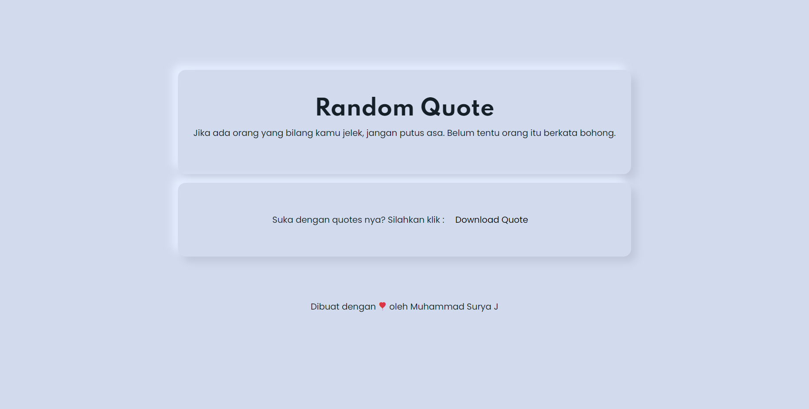

 
  
  &#xa0;

<h1 align="center">Random Quote</h1>

  

  

  

  

  

  

  <a href="#dart-tentang">Tentang</a> &#xa0; | &#xa0; 
  <a href="#rocket-teknologi">Teknologi</a> &#xa0; | &#xa0;
  <a href="#memo-lisensi">Lisensi</a> &#xa0; | &#xa0;
  <a href="https://github.com/suryamsj" target="_blank">Author</a>

 

## :dart: Tentang ##

Random Quote adalah sebuah web yang akan menampilkan quote secara random. Quote yang ditampilkan diambil dari API milik Akuari.

## :rocket: Teknologi ##

Teknologi yang digunakan pada project ini:

- [PHP](https://www.php.net/)
- [Bootstrap](https://getbootstrap.com/)
- [Scss](https://sass-lang.com/)
- [API](https://api.akuari.my.id/docs)
- [Html2Canvas](https://html2canvas.hertzen.com/)

## :memo: Lisensi ##

Project ini berlisensi MIT. Untuk lebih lanjut, silahkan lihat [LICENSE](LICENSE.md) file.

Dibuat dengan :heart: oleh <a href="https://github.com/suryamsj" target="_blank">Muhammad Surya Jayadiprana</a>

&#xa0;

<a href="#top">Back to top</a>
